
<h1 align="center">学生考勤管理系统的设计与实现+vue</h1>

## 简介
学生考勤管理系统：角色分为管理员、教师、辅导员、学生；提供个人中心、考勤管理、请假申请、通知管理、统计报告等功能，支持数据查询和导出，简化考勤流程。    --计算机毕业设计源码；毕设源码；java毕业设计源码

## 联系方式

<h3 align="center">获取完整代码与数据库文件 + 微信：deepguan QQ: 86050149 QQ群: 783742310</h3>

<h3 align="center">可帮忙远程部署 包运行成功！提供远程部署、修改代码、设计文档指导、代码讲解等服务！</h3>

## 功能介绍（完整见运行截图）
管理员： 提供用户管理、教师管理、考勤管理员管理等功能模块，支持管理相关的增删改查操作。管理员可通过指定的模块对系统内的基础数据进行维护和更新，包括课程信息管理、考勤通知管理、学生请假管理、公告信息管理等，支持筛选和数据统计。界面设计简洁直观，便于执行管理操作及日常监督。个人中心提供修改个人资料及密码更新的功能，确保系统安全性。

教师： 强调教师信息管理和考勤详细管理功能。教师可通过系统查看和管理个人负责的课程信息，以及学生的考勤记录。系统支持通过姓名、性别等条件进行教师信息查询和管理。此外，教师还可以通过该系统发布或管理考勤通知，查看考勤详情并及时了解学生的出勤情况。界面提供数据的新增、删除和修改功能，以适应具体管理需求。

学生： 提供便捷的个人信息查询和考勤数据查看功能。学生可以通过系统查看个人出勤记录及考勤状态，并进行请假申请。请假管理模块允许学生填写请假信息，同时支持查看审核意见及处理结果。考勤系统根据学生的出勤数据生成统计报告，通过柱状图直观展示出勤及缺勤数据，学生可查看自己在不同课程和时间段内的出勤情况。

考勤管理员： 负责学生出勤数据的审核和管理。通过系统审核学生的请假申请及考勤记录，并可对异常出勤情况进行标记和处理。考勤管理员可通过查询模块根据考勤状态、考勤专业以及考勤时间段对考勤信息进行筛选和管理。系统支持生成详细的统计报表及导出出勤数据，帮助考勤管理员全面掌控学生出勤状态并进行有效的数据分析。

## 运行截图
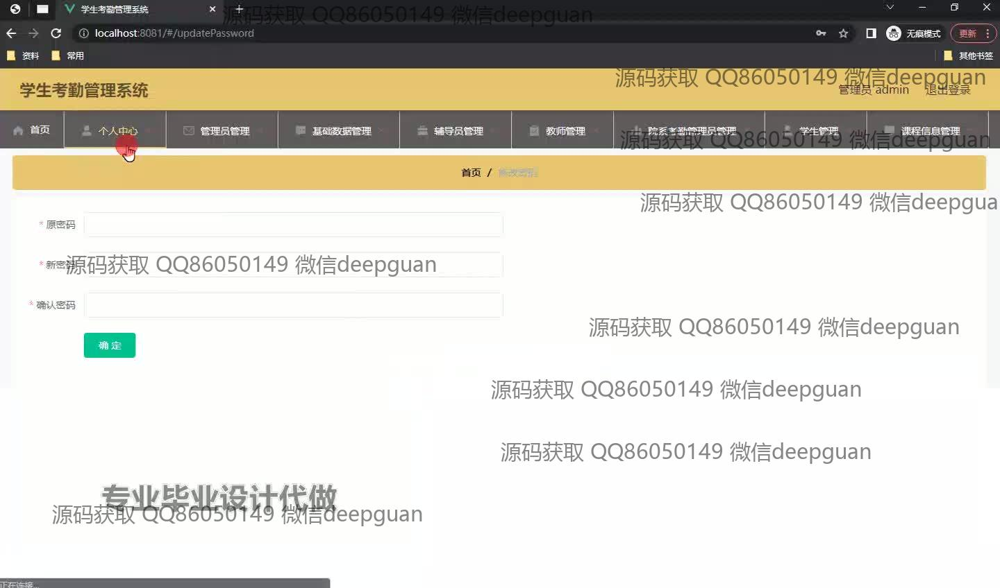
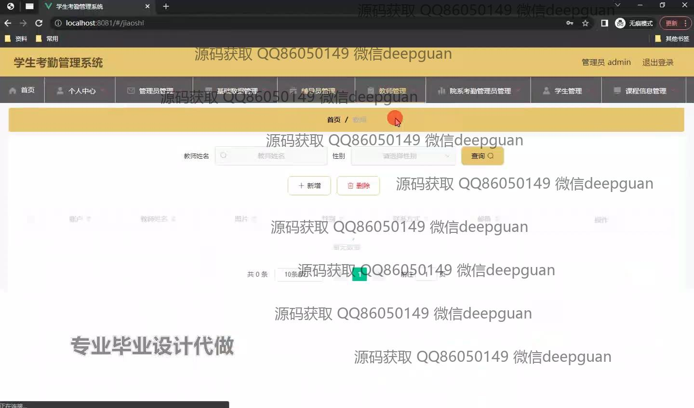
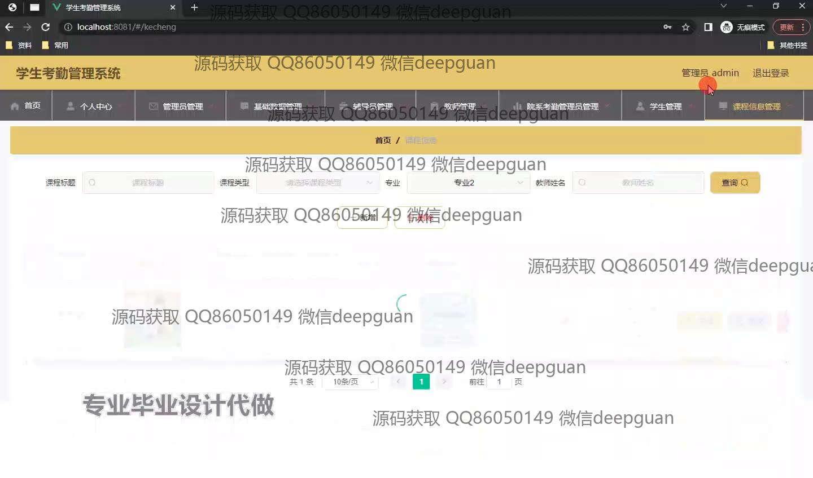

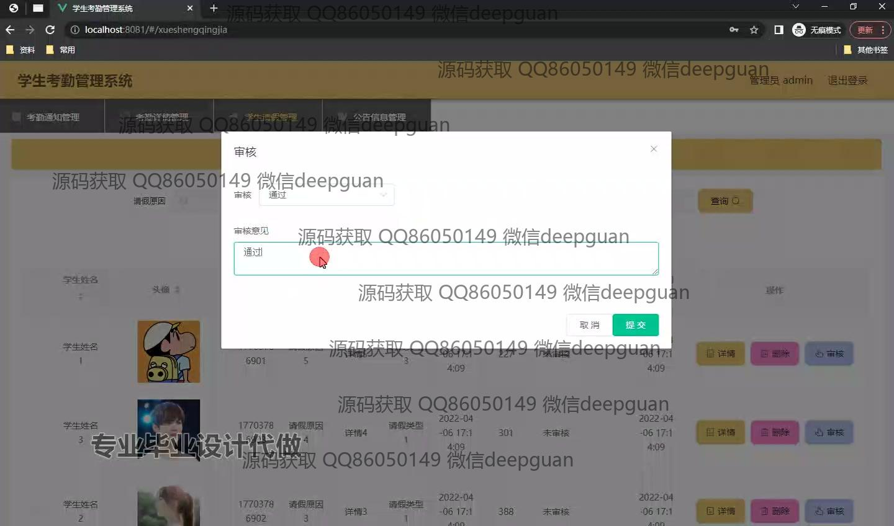
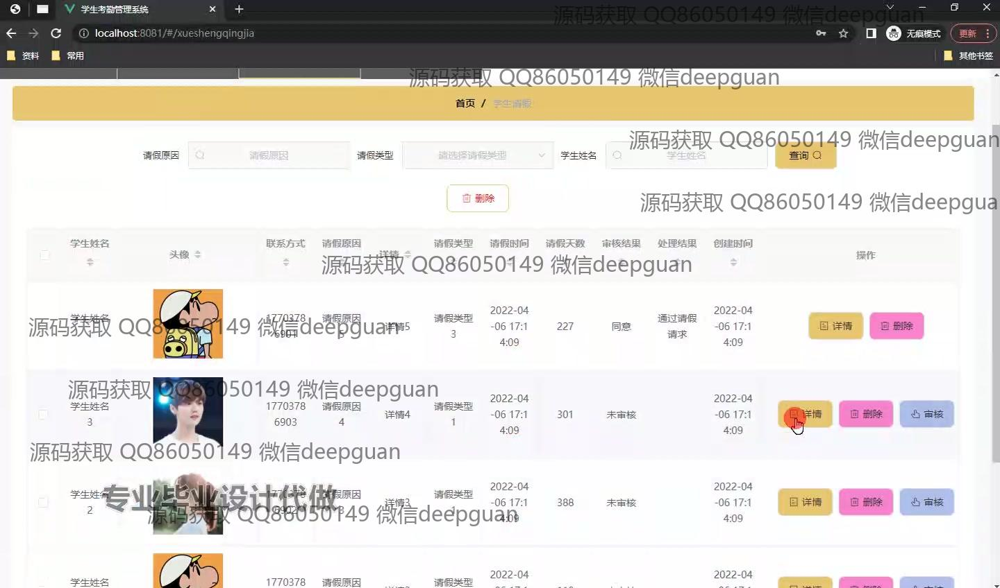
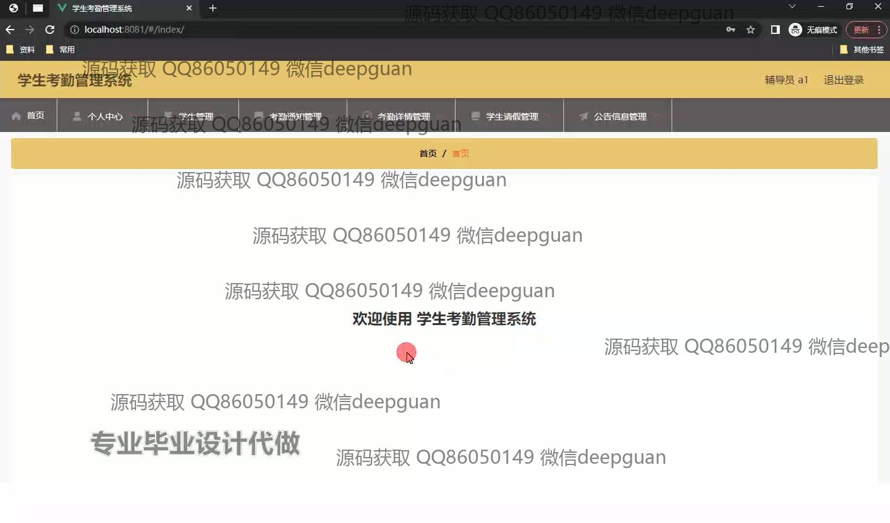
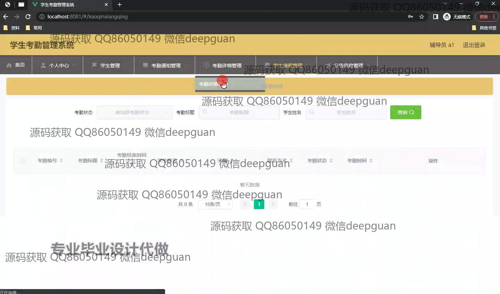
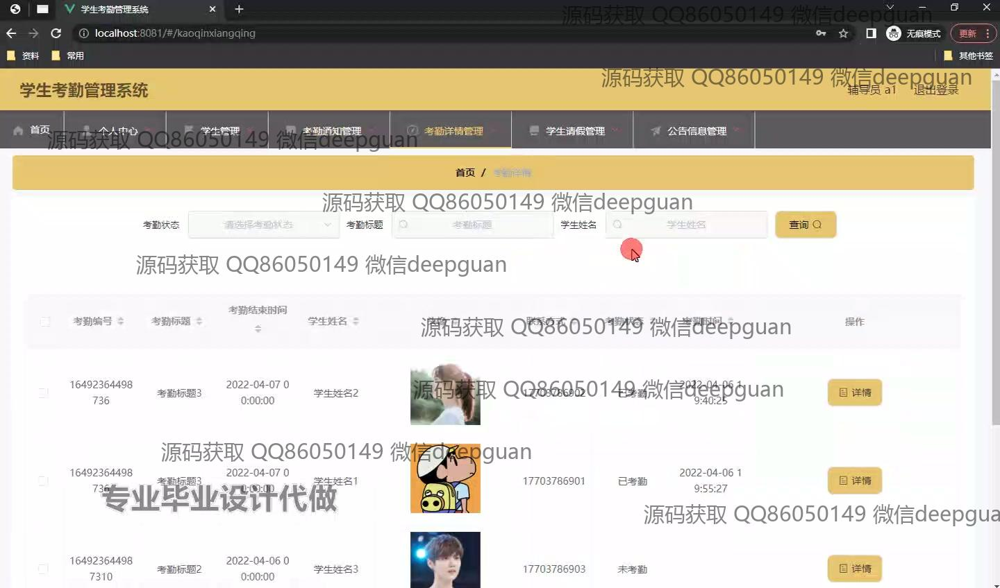
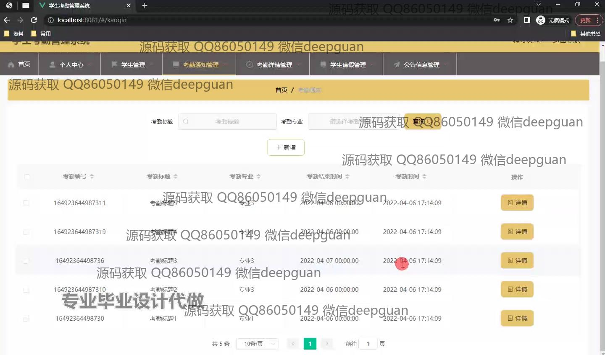
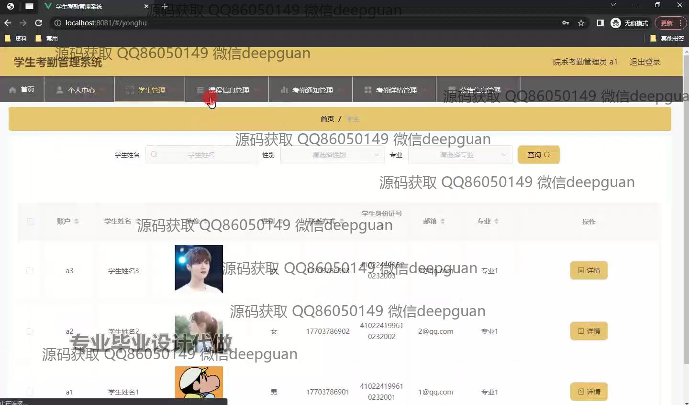
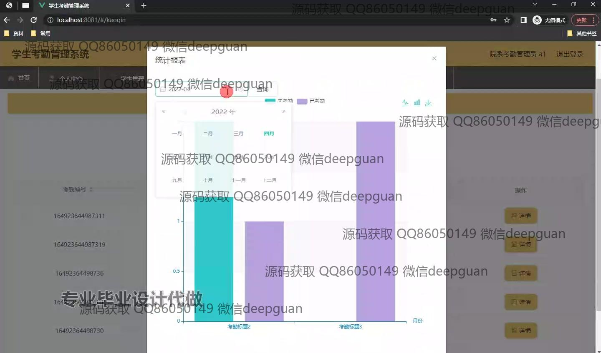
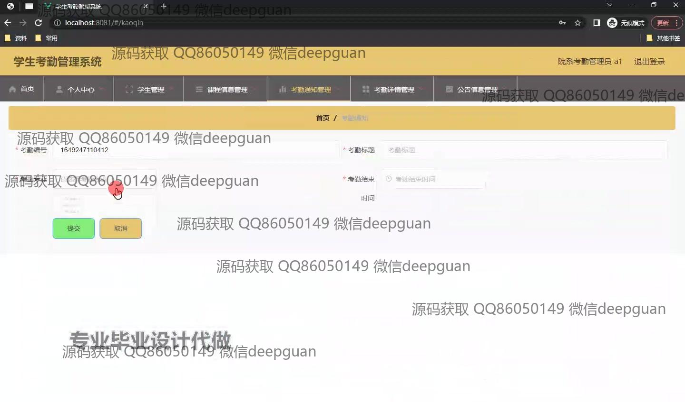
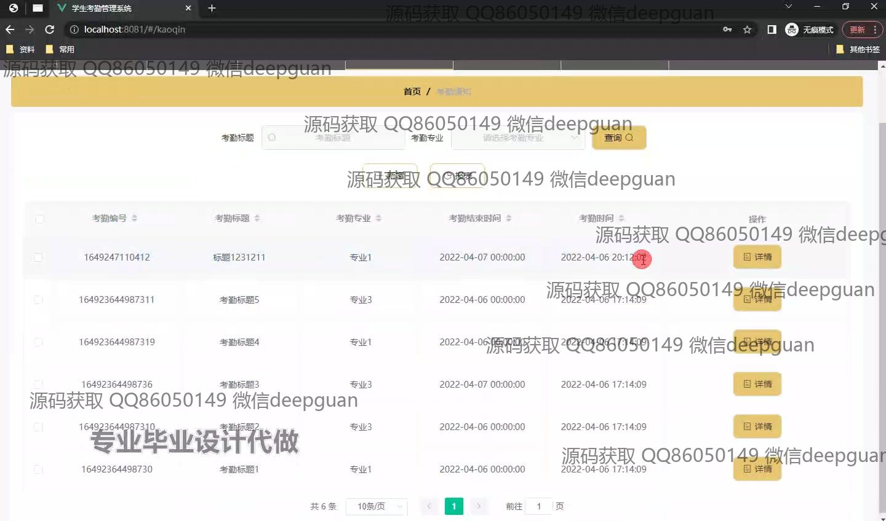
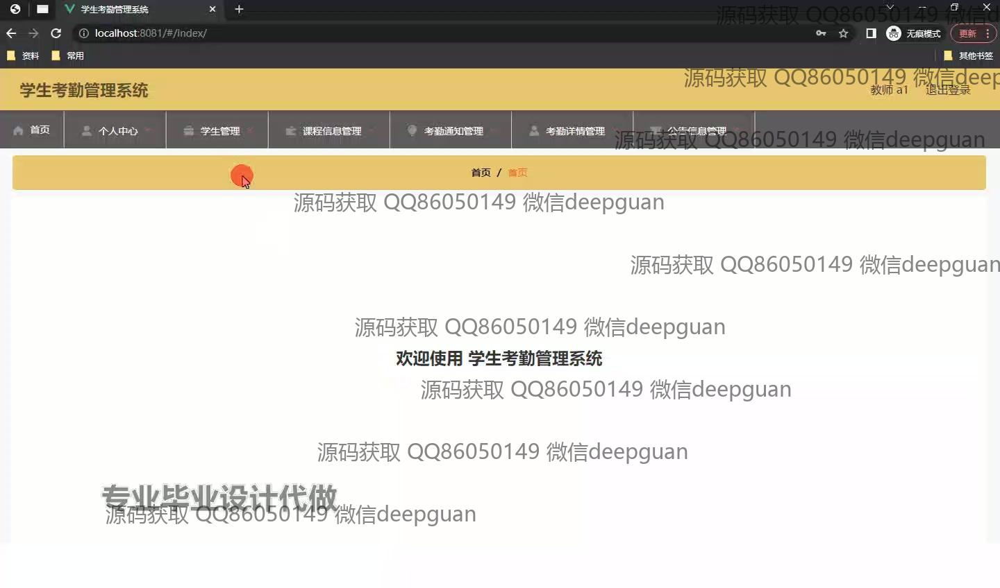
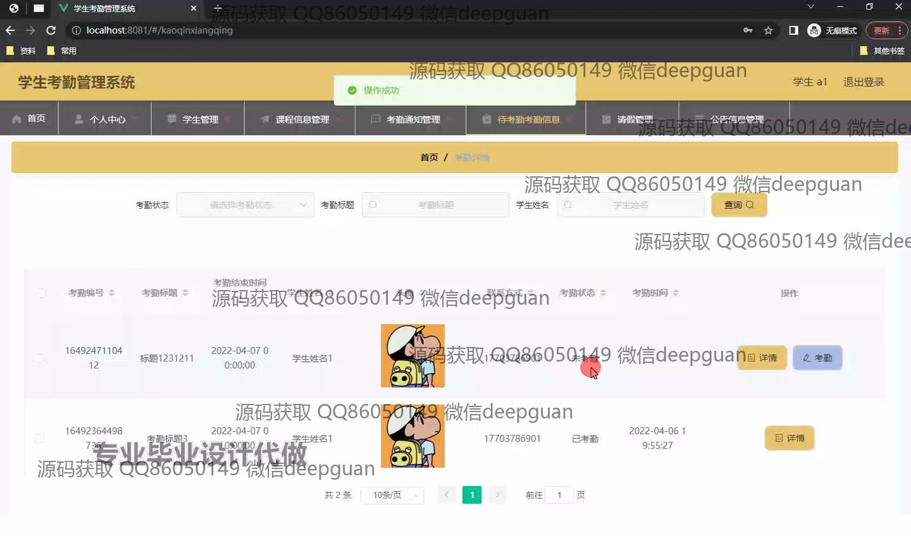
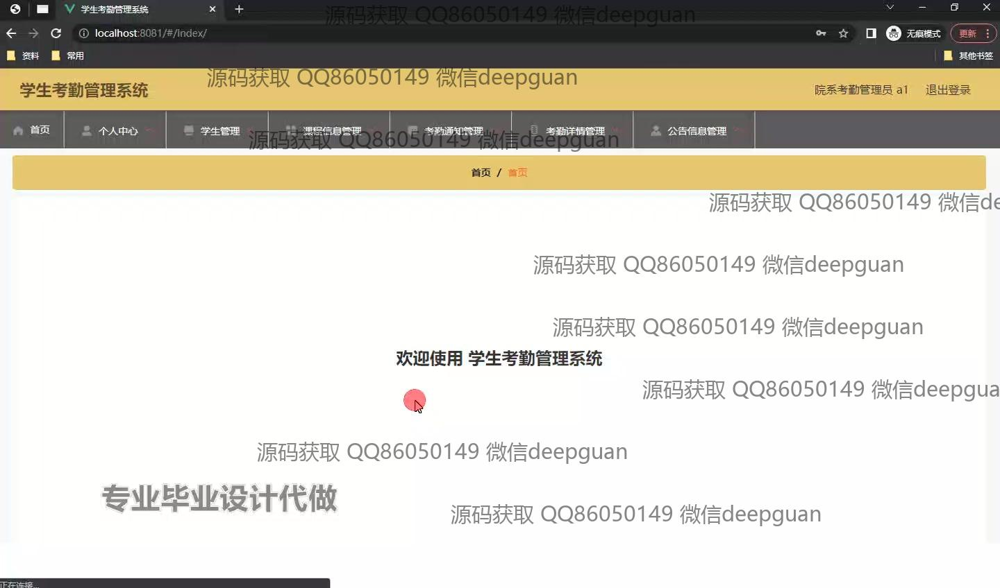
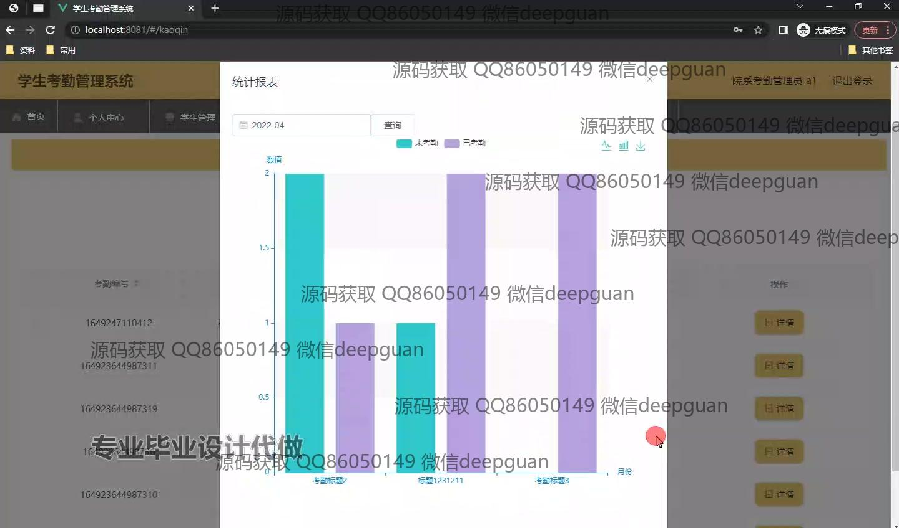

本代码来源于网络,仅供学习参考使用!

